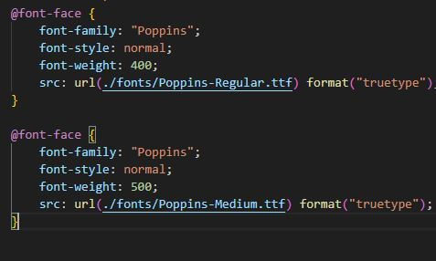
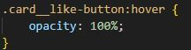
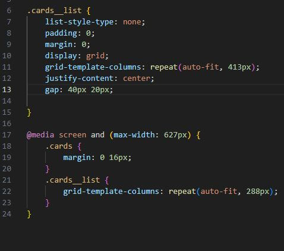
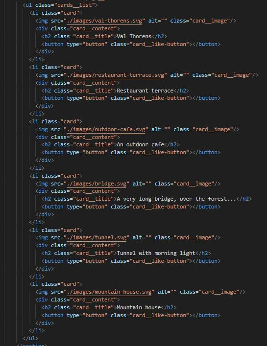

# Project 3: Spots

Project 3: Spots (Working with layouts)

### Overview  

* Intro 
* Project Features
* Description
* Figma  
* Github
* Video Overview
* Images 

  
**Intro**
  
This project is done with specific layout designs displayed correctly on common screen sizes for desktop and mobile.

**Project Features**
- Display grid, flex, and block layout
- Semantic HTML
- CSS Media Queries
- Font-Face in CSS
- HTML Lists
- Pseudo-class (:hover)

**Description**

This project showcases my skills and understanding of how @media on css works, working with a desktop display view of a minimum width of 1440px while the mobile version's display view has a maximum width of 627px. The project also showcases a proper way of using a grid layout and lists with the cards, as well as:hover pseudo-class on the buttons. All texts in this project used Poppins font with the fall back fonts of Arial, Helvetica, Sans-Serif.
  *
**Figma**  
  
* [Link to the project on Figma](https://www.figma.com/file/BBNm2bC3lj8QQMHlnqRsga/Sprint-3-Project-%E2%80%94-Spots?type=design&node-id=2%3A60&mode=design&t=afgNFybdorZO6cQo-1)
  
**Github**

* [Link to the project on Github](https://darenkier.github.io/se_project_spots/)

**Video Overview**
* [Link to the Video](https://drive.google.com/file/d/14RGEIHRwMRkAp4xmxFsELYUgq8qBZHMj/view?usp=sharing)

**Images**  
* Type of Poppins fonts used in this project, with a format of truetype.

* Pseudo-class hover was used on all of the buttons.

* How grid was utilized setting up the images, and how they are laid out on both desktop and mobile given width.

* The way HTML list was used in this project.

